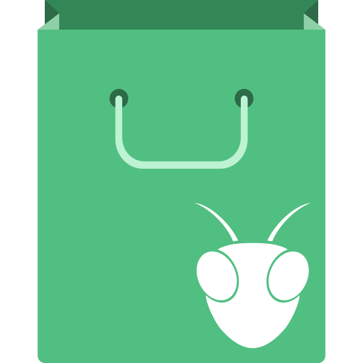

Mantis Starter
==============

> A modern kick-starter for front-end development packed with well-chosen tools


Get started
-----------

First of all, you need to have installed [Node.js](http://nodejs.org/) globally.
Then you can install by running the following command in your terminal:

```shell
sh -c "$(curl -fsSL https://raw.githubusercontent.com/acauamontiel/mantis-starter/master/install.sh)"
```

Otherwise you can install *"manually"* doing the following steps:

- Clone the repo: `git clone git@github.com:acauamontiel/mantis-starter.git my-project`
- Enter the folder: `cd my-project`
- Install Node dependencies: `yarn` or `npm install`

But I recommend you to install the easiest way.


Running
-------

You can run the app locally by running these following commands:

### Available Gulp commands

#### Default - `yarn start` or `npm start`

Run this commnad to compile and watch files running on [localhost:3000](http://localhost:3000)


#### Build - `yarn run build` or `npm run build`

Run this command to only compile files


#### Clean - `yarn run clean` or `npm run clean`

Run this command to delete the `public/` folder (same as `rm -rf public`)


Structure
---------

When you have all installed, the structure will look like this:

```
gulpfile.babel.js/
├── tasks/
│   └── *.js
├── index.js
└── paths.js
node_modules/
src/
├── copy/
│   ├── fonts/
│   │   └── *.{eot|svg|ttf|woff}
│   ├── **/*
├── css/
│   ├── components/
│   │   └── *.styl
│   ├── core/
│   │   └── *.styl
│   └── style.styl
├── html/
│   ├── components/
│   │   └── *.pug
│   ├── includes/
│   │   └── *.pug
│   ├── layouts/
│   │   └── *.pug
│   └── index.pug
├── img/
│   ├── backgrounds/
│   │   └── *.{jpg|png|svg}
│   ├── favicons/
│   │   └── *.{png|svg}
│   ├── sprite/
│   │   └── *.svg
│   └── *.{jpg|png|svg}
├── js/
│   ├── app/
│   │   ├── index.js
│   │   └── *.js
│   ├── modules/
│   │   └── *.js
│   └── app.js
.babelrc
.editorconfig
.env
.eslintrc
.gitattributes
.gitignore
.pug-lintrc
.stylintrc
content.json
install.sh
logo.png
logo.svg
package.json
README.md
```


License
-------

© 2016 - 2020 [Acauã Montiel](http://acauamontiel.com.br)

[MIT License](http://acaua.mit-license.org/)
